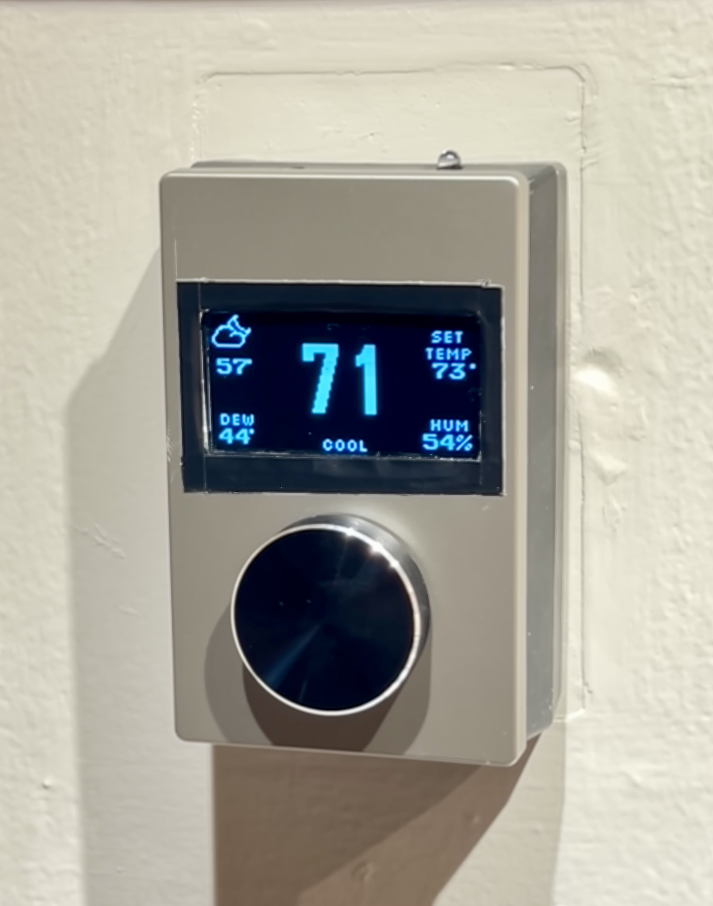
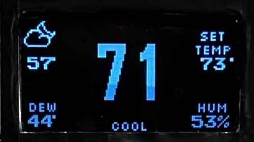
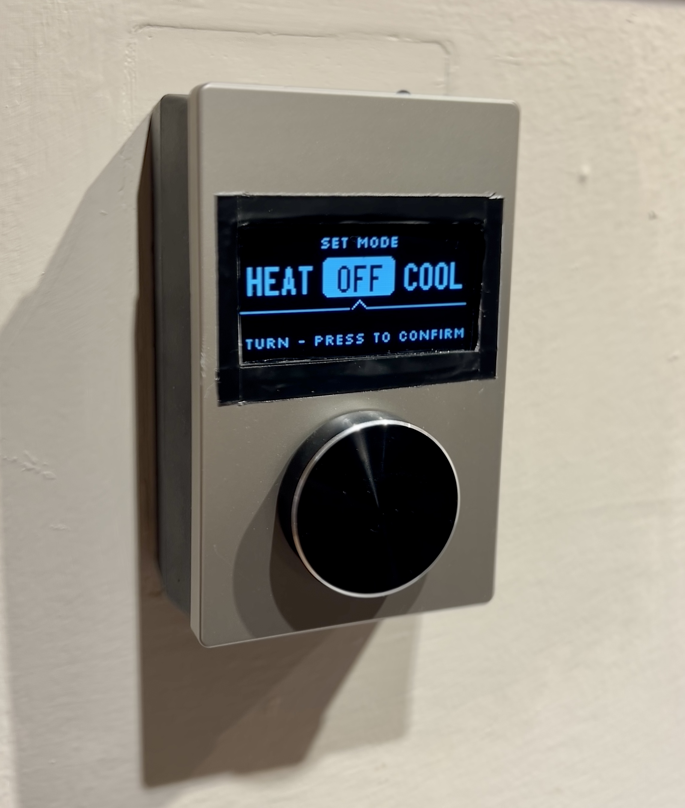
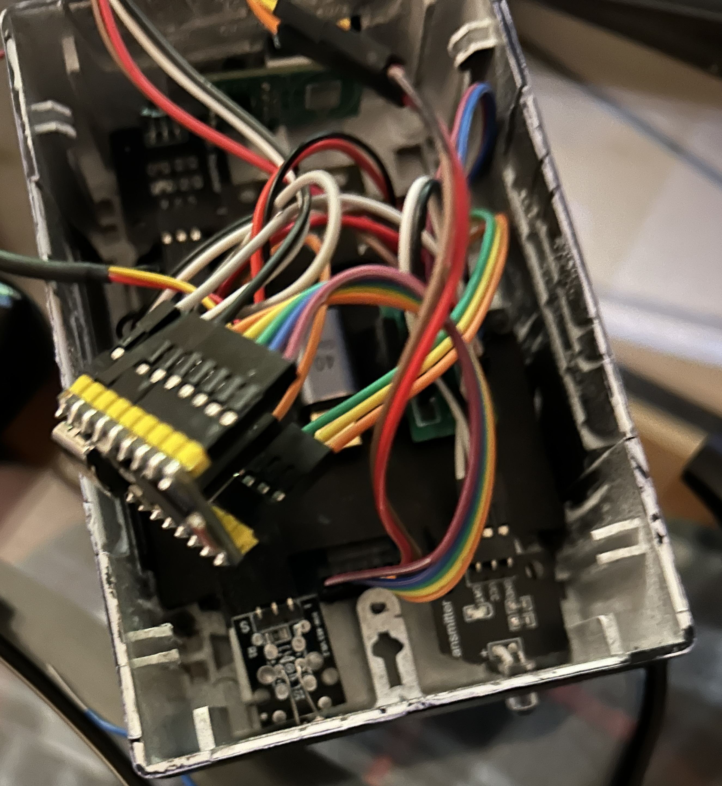
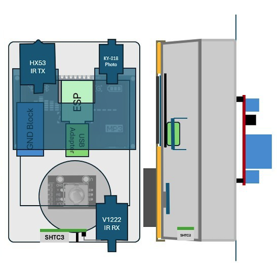
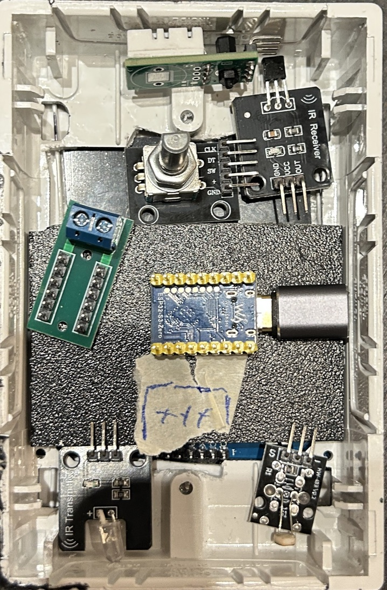

# Custom ESP32-S3 Fan Coil Thermostat

A DIY wall-mounted thermostat built around an ESP32-S3 for controlling a 120V fan coil system, designed with local-first control, physical UI, and Home Assistant integration.

## Documentation

- [Bill of Materials](./BOM.md)
- [ESPHome reference configuration](./thermostat_reference.yaml)
- [Custom SSD1309 helper](./my_ssd1309.h)

## Features

- Local thermostat control loop (not cloud dependent)
- 120V fan coil relay switching
- OLED UI (temperature, setpoint, humidity, outdoor weather)
- Rotary encoder control
- SHTC3 temperature / humidity sensing
- IR transmit/receive support
- Photo sensor-driven display/button dimming
- Home Assistant integration (setpoint + weather)
- Custom pixel weather sprites
- Standalone operation if HA is unavailable

## Hardware

- Waveshare ESP32-S3 Zero
- SSD1309 OLED (SPI)
- SHTC3 sensor
- Rotary encoder with push switch
- Isolated relay module
- KY-018 light sensor
- Piezo buzzer
- IR TX/RX
- 5V AC-DC power module

## Why I Built It

I have a seasonal 2-pipe 120V fan coil system and wanted something smarter than a conventional thermostat, while keeping control local and hackable.

## Project Photos

### Finished Installed Thermostat


### Main Runtime Display


### Mode Selection Interface


### Internal Assembly with Wiring Layout


Includes:
- 120V-AC 5V-DC fan coil relay switching
- 5V power supply (see BOM.md)
- ESP32-S3 pin mapping
- Sensor and OLED connections
- Terminal distribution layout reservations

## Display Features
- Custom OLED UI
- Ambient dimming
- Multi-screen rotary menu
- Hand-crafted pixel weather sprites

## Design Documentation

### Wiring Schematic
- [PDF schematic](./thermostat-wiring-schematic.pdf)
- [SVG schematic](./thermostat-wiring-schematic.svg)

### Internal Component Layout



(Esp32 and the mounting extender were rotated left 90° in final layout)


## Architecture
```text
Room temp -> control loop -> relay output
             |
             v
       OLED + local UI
             |
             v
Home Assistant (weather + optional setpoint)
```

## Home Assistant / HomeKit Climate Adapter

A standard thermostat climate entity does not map cleanly to a two-pipe fan coil system where heating or cooling is determined by the building and not selected by the user.  

The thermostat itself only controls whether the fan coil relay is energized, so this project includes a small Pyscript-based climate adapter to make the system behave correctly in Home Assistant and HomeKit:

- [Pyscript climate adapter](./thermostat_climate.py)

Rather than treating Heat/Cool as a direct command, the adapter infers the effective HVAC state from:

- selected seasonal mode
- room temperature
- setpoint
- relay state

For example:

```text
relay on + room temp above setpoint -> cooling
relay on + room temp below setpoint -> heating
relay off -> idle/off
```

## Future Ideas

- PID mode experimentation
- Optional Matter firmware variant
- Expanded HVAC modes
- More polished enclosure revisions

## Disclaimer

This project interfaces with mains voltage.
Use proper isolation and only attempt if you're comfortable working safely with line voltage.
